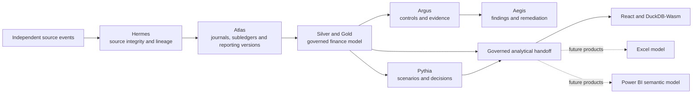
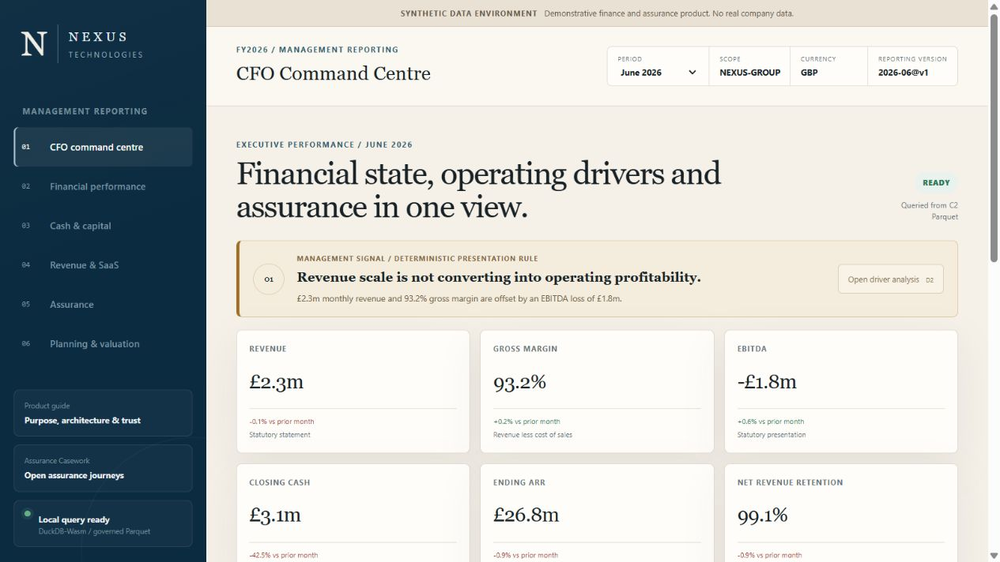
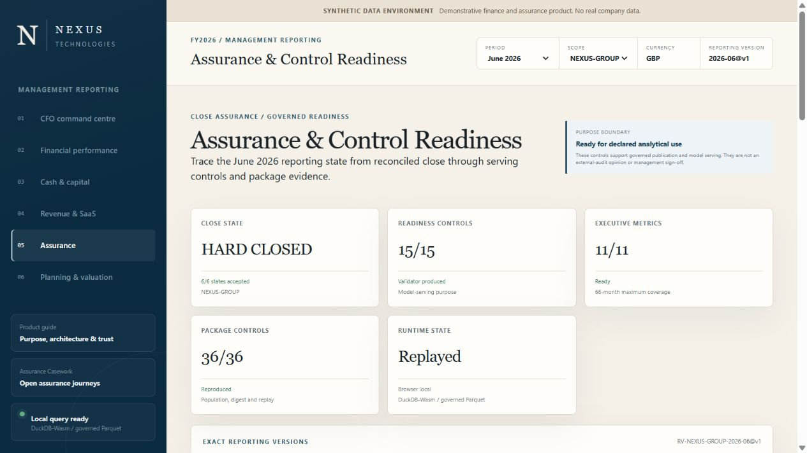
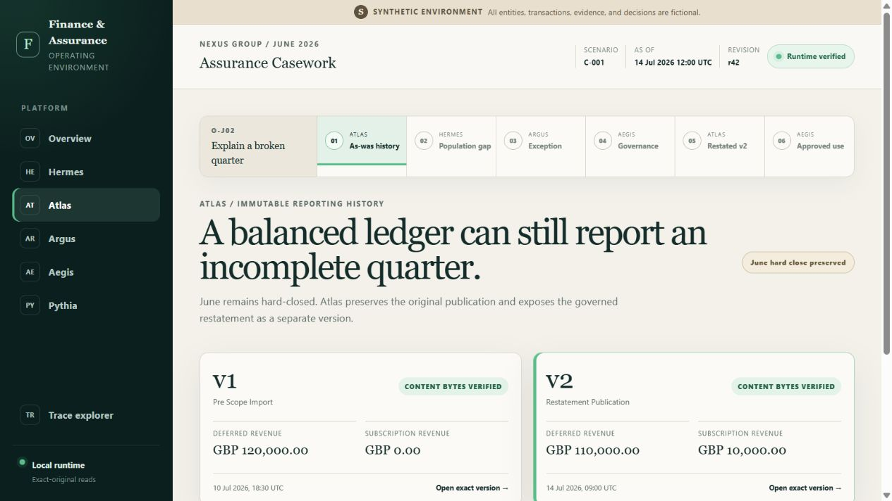

# Finance & Assurance Platform

An executable, synthetic finance operating environment showing how fragmented
business events become accounting records, governed management information,
continuous assurance, forecasts and decisions.

**Release target:** `v0.1 - Governed Finance Platform + React Intelligence Product`

> All entities, transactions and results are fictional. The repository is a
> portfolio and engineering demonstration; it is not an audit opinion,
> investment recommendation or production accounting system.


## What this demonstrates

- realistic multi-system finance event generation with defects, duplicates and late-arriving records;
- immutable Bronze ingestion and source identity through Hermes;
- rules-driven double-entry accounting, subledgers and reporting versions in Atlas;
- 66 months of reconciled income statement, balance-sheet and cash-flow history;
- fixed assets, banking, debt, leases, tax, equity, intercompany, procurement, billing, workforce and SaaS operating depth;
- typed Silver models and governed Gold facts, dimensions and executive marts;
- Argus control execution and Aegis evidence, finding and remediation journeys;
- governed Pythia scenario, liquidity and valuation-readiness outputs; and
- a serverless React product querying authenticated Parquet locally with DuckDB-Wasm.

## Architecture



The platform keeps business-event truth, source-system truth, accounting truth
and governed truth distinct. Only business events may drive posting rules;
accounting lifecycle events never re-enter the posting engine.

[Architecture and module ownership](docs/public-release/architecture.md) ·
[Artifact policy](docs/public-release/artifact-policy.md) ·
[Reproducibility](docs/public-release/reproducibility.md)

## v0.1 product surface

The React product contains six finite management experiences and a product guide:

1. CFO command centre
2. Financial performance
3. Cash and capital
4. Revenue and SaaS economics
5. Assurance and control readiness
6. Planning and valuation

The interface calculates no alternative accounting or DCF authority. Actuals
come from Atlas reporting versions; planning results come from sealed Pythia
model runs; each downloaded Parquet partition is authenticated before local
DuckDB registration.

## Product views

### CFO command centre



### Assurance and control readiness



### Assurance Casework



## Scale and governed state

| Layer | v0.1 position |
|---|---:|
| Source and Bronze datasets | 78 |
| Source/Bronze rows | 4,227,015 |
| Historical periods | 66 months |
| Typed Silver views | 70 |
| Governed Gold datasets | 99 |
| Governed relationships | 187 |
| Governed measure specifications | 189 |
| dbt tests | 387 |
| Independent finance controls | 64 |
| React runtime Parquet partitions | 114 |
| Pythia forecast results | 360 scenario-months |

## Quick start

Prerequisites:

- Python 3.13
- [uv](https://docs.astral.sh/uv/) 0.11.32
- Node.js 22.13 or newer

Install the locked Python environment:

```bash
uv sync --locked --dev
```

Start the complete local product, including the finite assurance API and React application:

```bash
uv run --locked python public_product.py serve
```

Open `http://127.0.0.1:3000`.

For the finance-intelligence frontend only (the Assurance Casework routes require
the complete launcher above):

```bash
cd web
npm ci
npm run dev
```

The repository includes the compact, governed v0.1 browser dataset. The pinned
DuckDB-Wasm module is prepared from `node_modules`; no hosted database, API key
or external company dataset is required.

## Validation

```bash
uv run ruff check .
uv run pytest -q
uv run python scripts/check_public_release.py

cd web
npm ci
npm run lint
npm run typecheck
npm run test:finance
npm test
```

GitHub Actions executes the same Python, public-hygiene and web gates on every
push and pull request.

## Repository map

```text
src/finance_assurance/   Python domain, runtime, generators and services
models/                  dbt Silver, Gold and governance models
macros/                  dbt macros
tests/                   Python, SQL and contract tests
web/                     React/vinext finance product
consumer-products/       Excel and Power BI product workspaces
docs/architecture/       Ratified architecture contracts and ADR log
docs/product/            Product and analytical contracts
docs/roadmap/            Implemented milestone records
docs/public-release/     Public architecture, artifacts and reproduction guide
scripts/                 Release and supporting build utilities
```

The roadmap is intentionally append-only. Its [index](docs/roadmap/README.md)
distinguishes current release work from retained correction and reassessment
evidence.

Generated warehouses, complete source populations, local Excel/PBIX files and
temporary evidence do not belong in source control. See the
[artifact policy](docs/public-release/artifact-policy.md).

## Roadmap

- `v0.1`: governed finance platform and React intelligence product
- `v0.2`: integrated Excel three-statement and DCF model
- `v0.3`: Power BI semantic and reporting product
- `v1.0`: complete cross-product portfolio release

## Project status and use

The v0.1 implementation is deterministic and extensively tested, but remains a
synthetic portfolio environment rather than production software. External
contributions are not currently accepted; responsible security reports are
welcome through GitHub's private reporting channel.

Copyright 2026 Lewis Andrews. All rights reserved. See [LICENSE.md](LICENSE.md).
